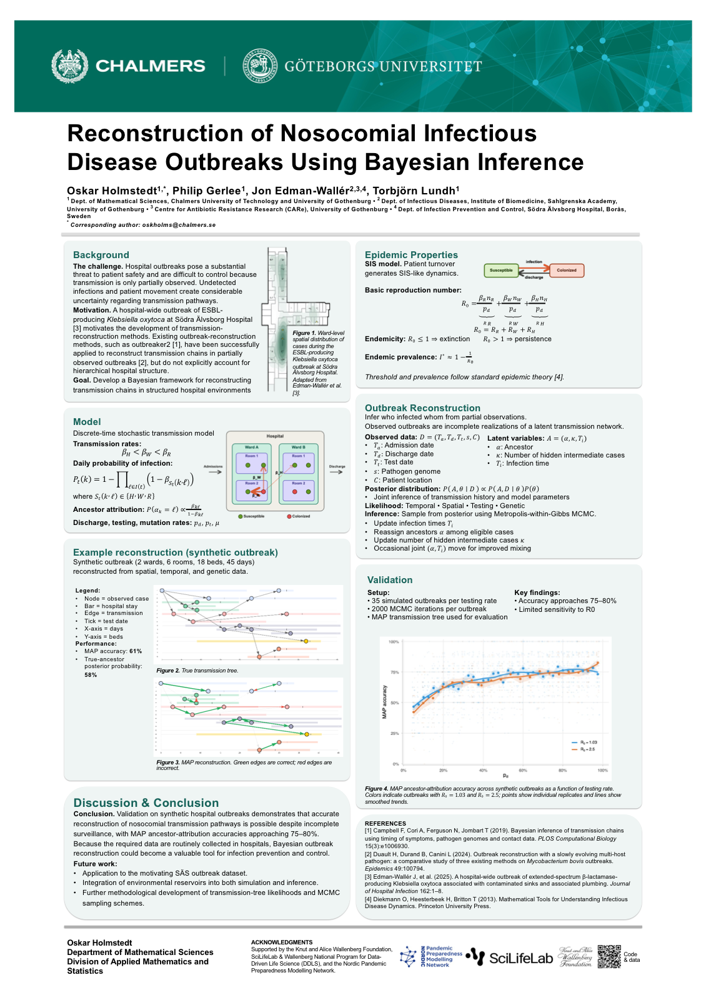

# Outbreak reconstruction for nosocomial infections

[](LICENSE)


Research code for simulating hospital outbreaks and reconstructing plausible
transmission chains from incomplete epidemiological and genetic observations.

## Overview

Nosocomial outbreak investigations rarely observe every infected patient or the
exact time and source of each transmission. This project develops a Bayesian
framework for reasoning about those missing events. It combines a stochastic,
spatially structured hospital model with Markov chain Monte Carlo (MCMC)
inference of infection times, transmission ancestors, and unobserved generations
between detected cases.

The current work focuses on synthetic outbreaks, where the inferred transmission
history can be compared with known ground truth. The longer-term aim is to apply
the method to real hospital data.

## Model workflow

1. Construct a hospital with beds grouped into rooms and wards.
2. Simulate transmission, testing, admission, and discharge over time.
3. Retain the partially observed outbreak and pairwise genetic distances.
4. Use MCMC to sample compatible infection times and transmission trees.
5. Evaluate reconstruction quality against the simulated ground truth.

The model allows transmission rates to differ within a room, within a ward, and
across the hospital. Genetic information can be included or omitted to assess
how much it contributes to reconstruction.

## Example reconstruction


Patient stays are arranged along the time axis and coloured by ward. Nodes mark
detected cases, while arrows show reconstructed transmission links. Edge colour
indicates the spatial scale of transmission. This example was generated from a
seeded synthetic outbreak.

## Poster

<p align="center">
  <a href="docs/poster/nosocomial-outbreak-reconstruction-poster-2026-07-08.pdf">
    
  </a>
</p>

The project poster, **Reconstruction of Nosocomial Infectious Disease Outbreaks
Using Bayesian Inference**, is available as a
[print-ready PDF](docs/poster/nosocomial-outbreak-reconstruction-poster-2026-07-08.pdf).
Its selected figures and supporting tables are documented under
[`results/`](results/README.md).

## Repository guide

| Path | Contents |
| --- | --- |
| [`R/`](R) | Reusable simulation, inference, analysis, and plotting functions |
| [`config/`](config) | Model parameters and hospital layouts |
| [`scripts/quick_start.R`](scripts/quick_start.R) | Canonical seeded simulation and inference example |
| [`scripts/demo.R`](scripts/demo.R) | Full poster-figure and diagnostic workflow |
| [`scripts/run_accuracy_sweeps.R`](scripts/run_accuracy_sweeps.R) | Long-running simulation experiments |
| [`reports/`](reports) | Authored Quarto reports |
| [`scripts/validate.R`](scripts/validate.R) | Complete validation entry point |
| [`tests/`](tests) | Unit and deterministic smoke checks |
| [`results/`](results) | Selected poster figures, tables, and provenance |
| [`docs/poster/`](docs/poster) | Poster PDF and web preview |
| [`environment.yaml`](environment.yaml) | Complete Conda environment specification |
| [`docs/dependencies.md`](docs/dependencies.md) | Required and optional dependency guidance |
| [`data/README.md`](data/README.md) | Data handling and provenance guidance |
| [`docs/artifact-policy.md`](docs/artifact-policy.md) | Rules for generated and versioned outputs |

Selected figures and tables are stored under `results/`; regenerable caches and
exploratory artifacts remain outside version control. See the
[artifact policy](docs/artifact-policy.md) for the selection rules.

## Getting started

Create and activate the complete Conda environment:

```sh
mamba env create --file environment.yaml
conda activate nosocomial-infection-model
Rscript scripts/install_dependencies.R
```

See the [dependency guide](docs/dependencies.md) for Conda alternatives and the
distinction between core, reporting, validation, and optional export packages.

Clone the repository, install the required packages, and run the canonical
example from the repository root:

```sh
git clone https://github.com/OskarHolmstedt/nosocomial_infection_model.git
cd nosocomial_infection_model
Rscript scripts/quick_start.R
```

The default run takes about two seconds on a typical laptop and prints:

```text
Quick start complete
  Total simulated cases: 17
  Observed cases: 10
  MCMC samples: 1000 (+ 200 burn-in)
  Ancestry mode accuracy: 0.400
  Mean P(true ancestor): 0.463
  Visualization: .../output/quick-start-reconstruction.html
```

Open `output/quick-start-reconstruction.html` in a browser to inspect the
reconstructed transmission timeline. Keep its adjacent
`quick-start-reconstruction_files/` directory with it. Both outputs are
regenerable and ignored by Git.

The full poster workflow remains in `scripts/demo.R`; long-running parameter
sweeps are isolated in `scripts/run_accuracy_sweeps.R`.

## Validation

Run all unit tests, the deterministic quick-start smoke check, and lightweight
Quarto report renders from the repository root:

```sh
Rscript scripts/validate.R
```

Set `NOSOCOMIAL_SKIP_REPORT_CHECKS=true` to omit Quarto checks when working on a
system without Quarto. Generated validation files are temporary and do not alter
the working tree.

## Project status

This repository contains research software under active development. Interfaces,
model assumptions, output formats, and results may change. The code has not yet
been prepared as a stable R package, and no archival software release has been
published.

No confidential hospital records or patient-level data should be committed to
this repository. The data currently included are generated from simulations.

## Project team

- Oskar Holmstedt — PhD student — [oskholms@chalmers.se](mailto:oskholms@chalmers.se)
- Philip Gerlee — supervisor — [gerlee@chalmers.se](mailto:gerlee@chalmers.se)
- Jon Edman Wallér — co-supervisor — [jon.edman@vgregion.se](mailto:jon.edman@vgregion.se)
- Torbjörn Lundh — co-supervisor — [torbjorn.lundh@chalmers.se](mailto:torbjorn.lundh@chalmers.se)

## Citation

There is not yet a citable software release or permanent DOI. Until one is
available, cite the repository and include the commit or release used:

> Holmstedt, O. *Outbreak reconstruction for nosocomial infections*. Research
> software, work in progress.
> <https://github.com/OskarHolmstedt/nosocomial_infection_model>

## License

The source code is available under the [MIT License](LICENSE).
