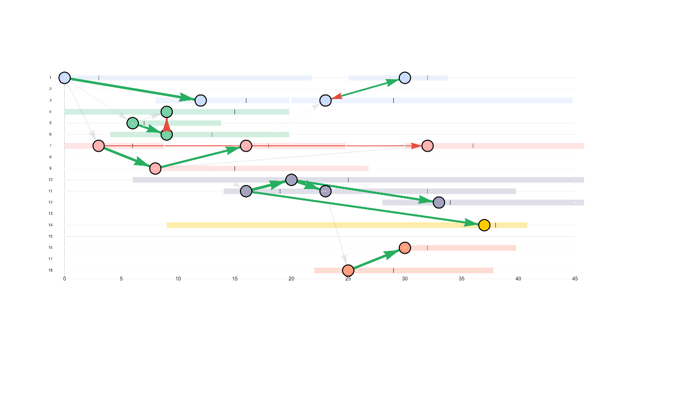

# Outbreak reconstruction for nosocomial infections

[](LICENSE)


Research code for simulating hospital outbreaks and reconstructing plausible
transmission chains from incomplete epidemiological and genetic observations.

## Overview

Nosocomial outbreak investigations rarely observe every infected patient or the
exact time and source of each transmission. This project develops a Bayesian
framework for reasoning about those missing events. It combines a stochastic,
spatially structured hospital model with Markov chain Monte Carlo (MCMC)
inference of infection times, transmission ancestors, and unobserved generations
between detected cases.

The current work focuses on synthetic outbreaks, where the inferred transmission
history can be compared with known ground truth. The longer-term aim is to apply
the method to real hospital data.

## Model workflow

1. Construct a hospital with beds grouped into rooms and wards.
2. Simulate transmission, testing, admission, and discharge over time.
3. Retain the partially observed outbreak and pairwise genetic distances.
4. Use MCMC to sample compatible infection times and transmission trees.
5. Evaluate reconstruction quality against the simulated ground truth.

The model allows transmission rates to differ within a room, within a ward, and
across the hospital. Genetic information can be included or omitted to assess
how much it contributes to reconstruction.

## Example reconstruction



Patient stays are arranged along the time axis and coloured by ward. Nodes mark
detected cases, while arrows show reconstructed transmission links. Edge colour
indicates the spatial scale of transmission. This example was generated from a
seeded synthetic outbreak.

## Repository guide

| Path | Contents |
| --- | --- |
| [`R/`](R) | Reusable simulation, inference, analysis, and plotting functions |
| [`config/`](config) | Model parameters and hospital layouts |
| [`scripts/demo.R`](scripts/demo.R) | Seeded simulation and inference demonstration |
| [`scripts/run_accuracy_sweeps.R`](scripts/run_accuracy_sweeps.R) | Long-running simulation experiments |
| [`reports/`](reports) | Authored Quarto reports |
| [`tests/test-model.R`](tests/test-model.R) | Current model checks |
| [`environment.yaml`](environment.yaml) | Preliminary Conda environment specification |
| [`data/README.md`](data/README.md) | Data handling and provenance guidance |
| [`docs/artifact-policy.md`](docs/artifact-policy.md) | Rules for generated and versioned outputs |

Generated figures and experiment outputs are currently stored alongside the
research code. The repository layout and artifact policy are being reorganized in
[issue #4](https://github.com/OskarHolmstedt/nosocomial_infection_model/issues/4).

## Getting started

The current workflow requires R with `here`, `Matrix`, `igraph`, `epicontacts`,
`visNetwork`, `expm`, and `ggplot2`. Plot diagnostics and figure export also use
`patchwork`, `htmlwidgets`, and `webshot2`. The complete environment is being
consolidated as part of the reproducibility work.

Clone the repository, install the required packages, and run the current
demonstration from the repository root:

```sh
git clone https://github.com/OskarHolmstedt/nosocomial_infection_model.git
cd nosocomial_infection_model
Rscript scripts/demo.R
```

The demo simulates a seeded outbreak, runs MCMC reconstruction, reports ancestry
accuracy, creates diagnostic plots, and exports selected figures under
`results/figures/`. For a quick smoke run without figure export:

```sh
NOSOCOMIAL_MCMC_SAMPLES=100 NOSOCOMIAL_SKIP_EXPORT=true Rscript scripts/demo.R
```

The committed Conda environment is not yet a complete dependency lockfile. A
smaller canonical quick start and a reproducible environment are tracked in
[issue #2](https://github.com/OskarHolmstedt/nosocomial_infection_model/issues/2)
and [issue #3](https://github.com/OskarHolmstedt/nosocomial_infection_model/issues/3).

## Project status

This repository contains research software under active development. Interfaces,
model assumptions, output formats, and results may change. The code has not yet
been prepared as a stable R package, and no archival software release has been
published.

No confidential hospital records or patient-level data should be committed to
this repository. The data currently included are generated from simulations.

## Project team

- Oskar Holmstedt — PhD student — [oskholms@chalmers.se](mailto:oskholms@chalmers.se)
- Philip Gerlee — supervisor — [gerlee@chalmers.se](mailto:gerlee@chalmers.se)
- Jon Edman Wallér — co-supervisor — [jon.edman@vgregion.se](mailto:jon.edman@vgregion.se)
- Torbjörn Lundh — co-supervisor — [torbjorn.lundh@chalmers.se](mailto:torbjorn.lundh@chalmers.se)

## Citation

There is not yet a citable software release or permanent DOI. Until one is
available, cite the repository and include the commit or release used:

> Holmstedt, O. *Outbreak reconstruction for nosocomial infections*. Research
> software, work in progress.
> <https://github.com/OskarHolmstedt/nosocomial_infection_model>

## License

The source code is available under the [MIT License](LICENSE).
